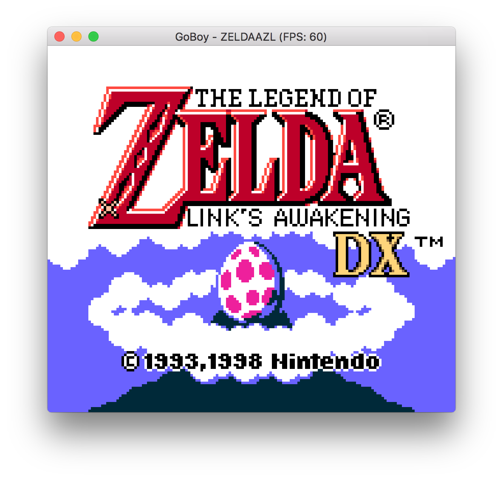
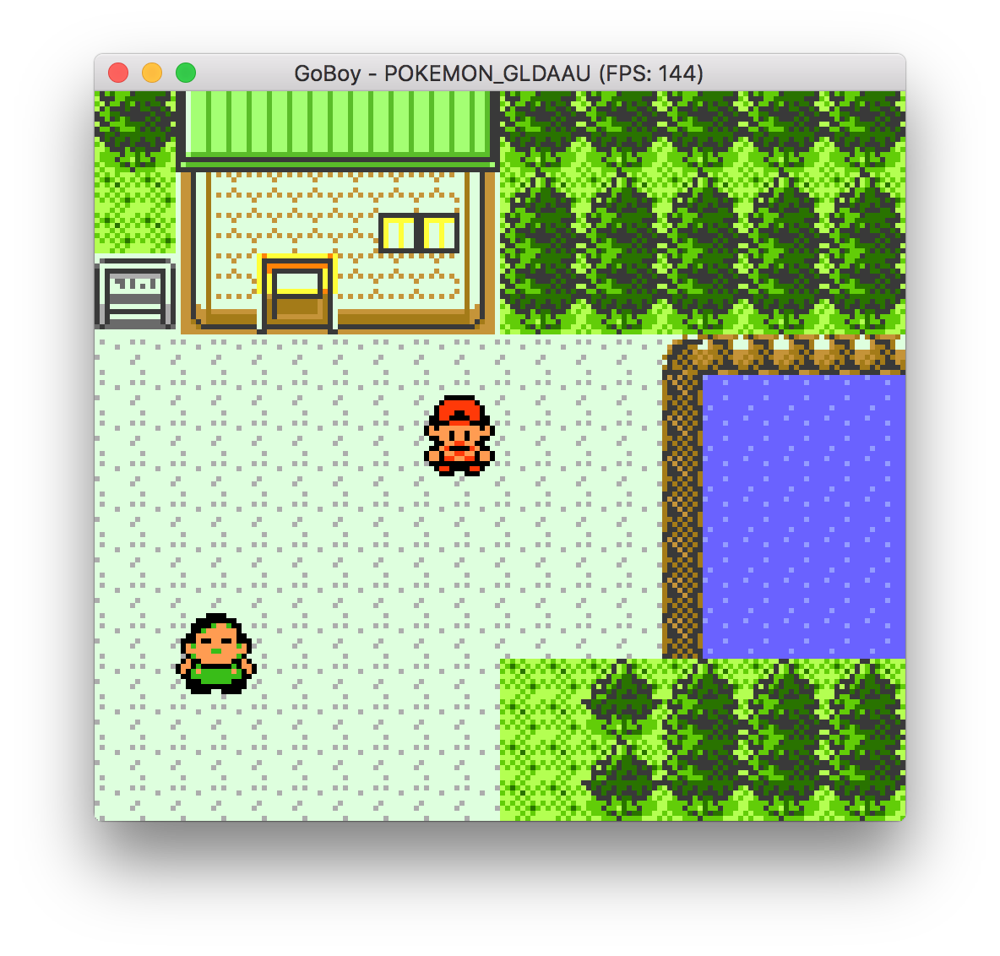
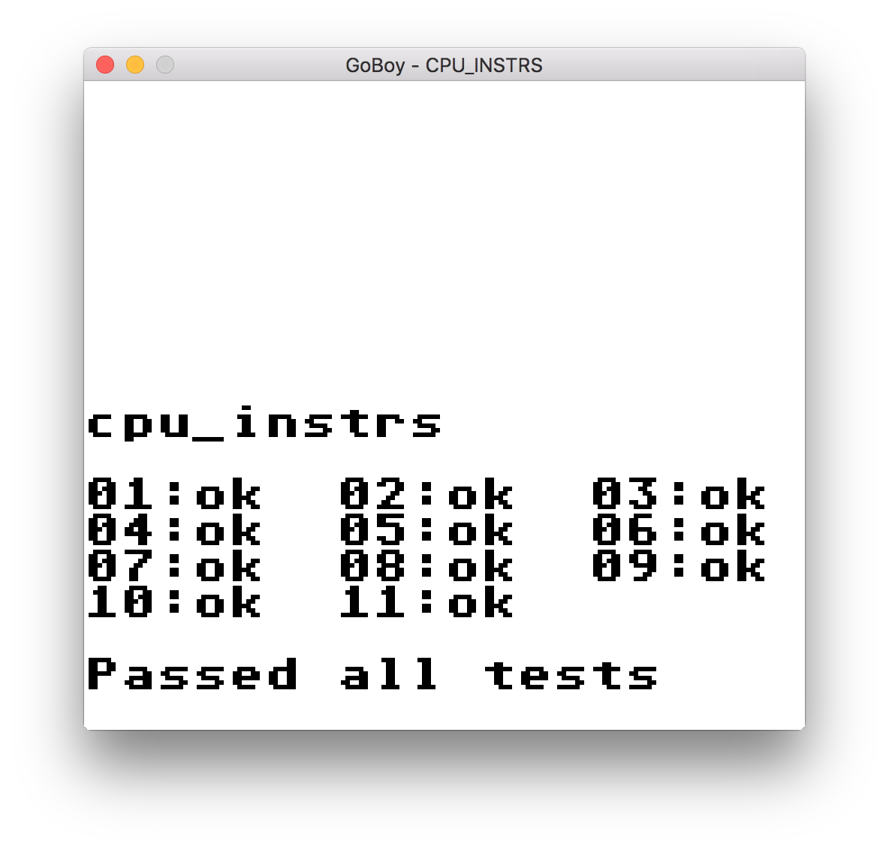
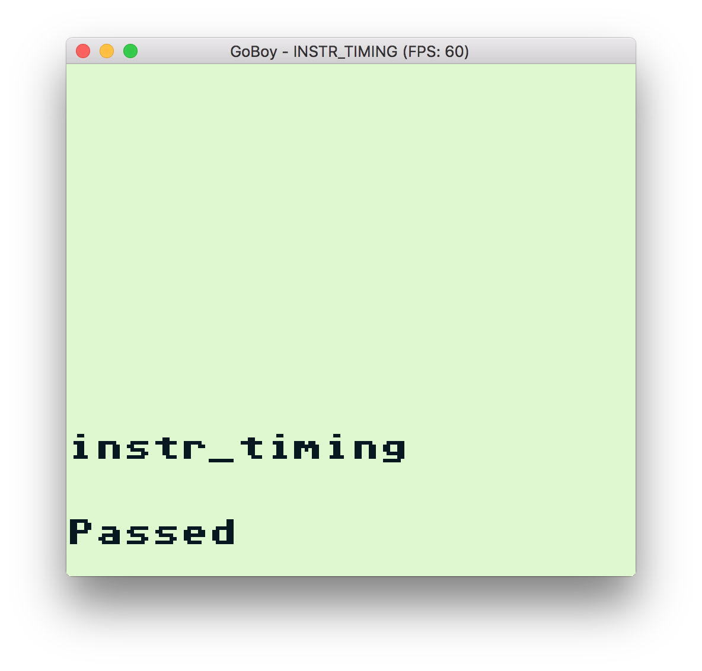
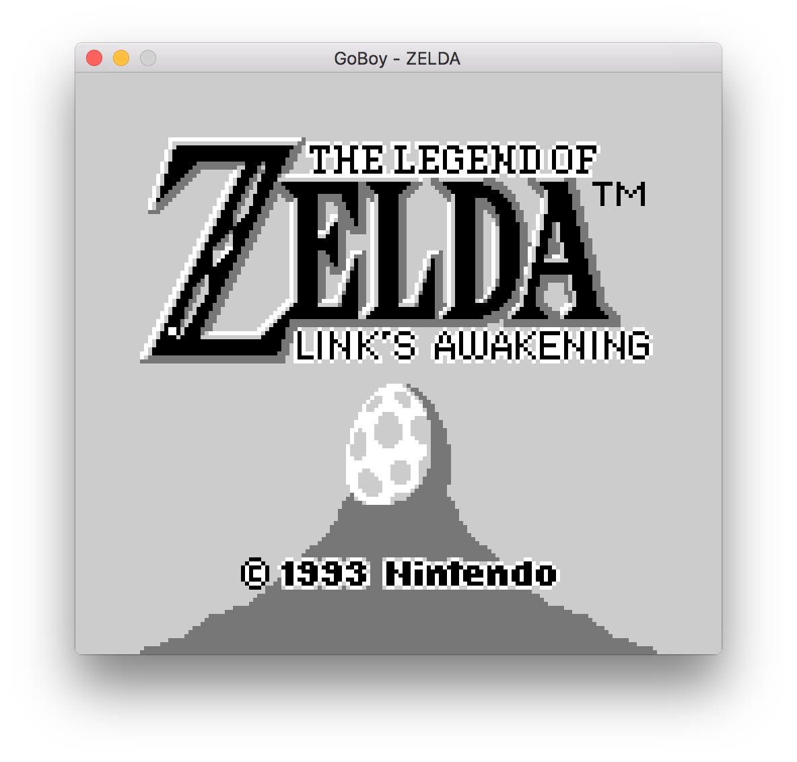
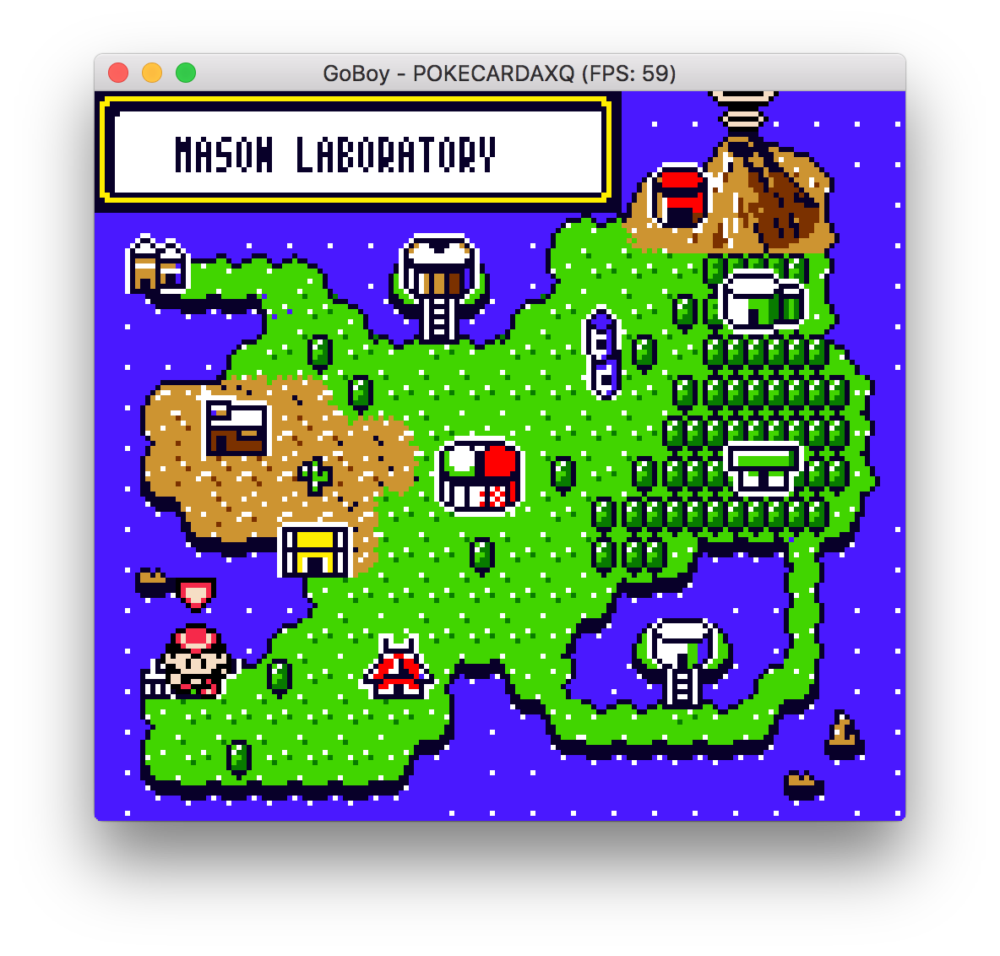
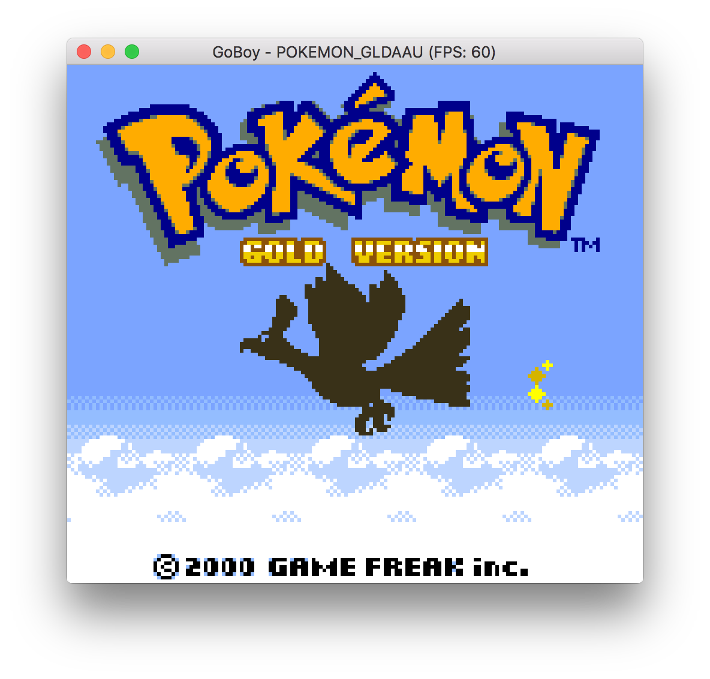
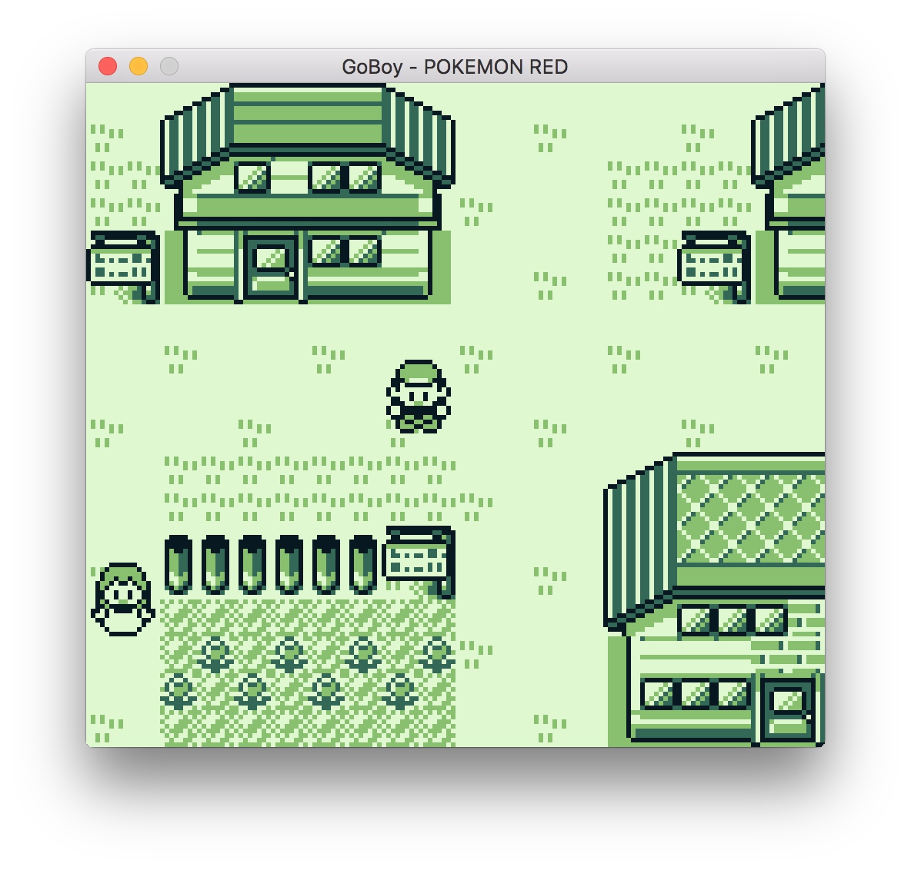

# GoBoy

[](https://travis-ci.org/Humpheh/goboy)
[](https://codecov.io/gh/Humpheh/goboy)
[](https://goreportcard.com/report/github.com/Humpheh/goboy)
[](https://godoc.org/github.com/Humpheh/goboy)

GoBoy is a multi-platform Nintendo GameBoy and GameBoy Color emulator written in go.
The emulator can run the majority of GB games and some CGB games. There is also
colour and sound support.
This emulator was primarily built as a development exercise and is still work in progress.
Please feel free to contribute if you're interested in GameBoy emulator development.



The program includes debugging functions making it useful for understanding the emulator operation for
building one yourself. These functions include printing of opcodes and register values to the console at each
step (although will greatly slow down the emulation) and toggling of individual sound channels.

## Installation
```sh
go get github.com/Humpheh/goboy/cmd/goboy
```

The program has been tested on MacOS and Windows 10, and is likely to work on Linux. Building on Windows 10
requires MinGW.

GoBoy uses the go library [pixel](https://github.com/faiface/pixel) for control binding and graphics rendering,
which requires OpenGL. You may need to install some requirements which can be found on the
[pixels readme](https://github.com/faiface/pixel#requirements).

## Usage 
```sh
goboy zelda.gb
```
Controls: <kbd>&larr;</kbd> <kbd>&uarr;</kbd> <kbd>&darr;</kbd> <kbd>&rarr;</kbd> <kbd>Z</kbd> <kbd>X</kbd> <kbd>Enter</kbd> <kbd>Backspace</kbd>

The colour palette can be cycled with <kbd>=</kbd> (in DMG mode), and the game can
be made fullscreen with <kbd>F</kbd>.


Other options:
```sh
  -dmg
    	set to force dmg mode
  -mute
    	mute sound output
```

Debug or experimental options:
```sh
  -cpuprofile string
    	write cpu profile to file (debugging)
  -disableVsync
    	set to disable vsync (debugging)
  -load string
    	location of save state to load (experimental)
  -stepthrough
    	step through opcodes (debugging)
  -unlocked
    	if to unlock the cpu speed (debugging)
```

### Debugging
There are a few keyboard shortcuts useful for debugging: 

<kbd>Q</kbd> - force toggle background<br/>
<kbd>W</kbd> - force toggle sprites<br/>
<kbd>A</kbd> - print gb background palette data (cgb)<br/>
<kbd>S</kbd> - print sprite palette data (cgb)<br/>
<kbd>D</kbd> - print background map to log<br/>
<kbd>E</kbd> - toggle opcode printing to console (will slow down execution)<br/>
<kbd>7,8,9,0</kbd> - toggle sound channels 1 through 4.

### Saving 
If the loaded rom supports a battery a `<rom-name>.sav` (e.g. `zelda.gb.sav`) file will be created
next to the loaded rom containing a dump of the RAM from the cartridge. A loop in the program will
update this save file every second while the game is running.

## Testing
GoBoy currently passes all of the tests in Blargg's `cpu_instrs` and `instr_timing` test roms.



These roms are included in the source code along with a test to check the output is as expected
(`instructions_test.go` and `timing_test.go`). These tests are also run on each commit.

## Contributing

Please feel free to open pull requests to this project or play around if you're interested! There are
still plenty of small bugs that can easily be found through playing games on the emulator, or take a
task from the TODO list below!

## Known Bugs 
- [ ] Sprite Z-drawing
- [x] Sprites near edge of screen not drawing
- [x] Top half of sprite disappearing off top of screen
- [x] Small sprites row glitch
- [ ] Many CGB bugs
- [x] BG tile window offset issue - visible on *Pokemon Red* splash screen - possibly mistimed interrupt?
- [ ] Harry Potter and The Chamber of Secrets has odd sprite issues
- [ ] Request to set screen to white does not do so

## TODO List
- [x] MBC3 banking support
- [x] GameBoy Color support (partial)
- [ ] Rewrite APU emulation
- [ ] MBC3 clock support
- [ ] Complete CGB emulation
- [ ] Icon
- [ ] White screen when off
- [ ] Speed up CPU
- [x] Resizable window
- [ ] Some kind of nice UI
- [ ] MBC4-7 support (?)
- [ ] More colour palettes
- [ ] STOP opcode behaviour
- [ ] [Blargg's test ROMs](http://gbdev.gg8.se/wiki/articles/Test_ROMs)





## Resources
A large variety of resources were used to understand and test the GameBoy hardware. Some of these include:
* <http://www.codeslinger.co.uk/pages/projects/gameboy/files/GB.pdf>
* <https://github.com/retrio/gb-test-roms>
* <http://www.codeslinger.co.uk/pages/projects/gameboy/beginning.html>
* <http://bgb.bircd.org/> - invaluable for debugging
* <https://github.com/AntonioND/giibiiadvance/tree/master/docs>
* <https://github.com/trekawek/coffee-gb>
