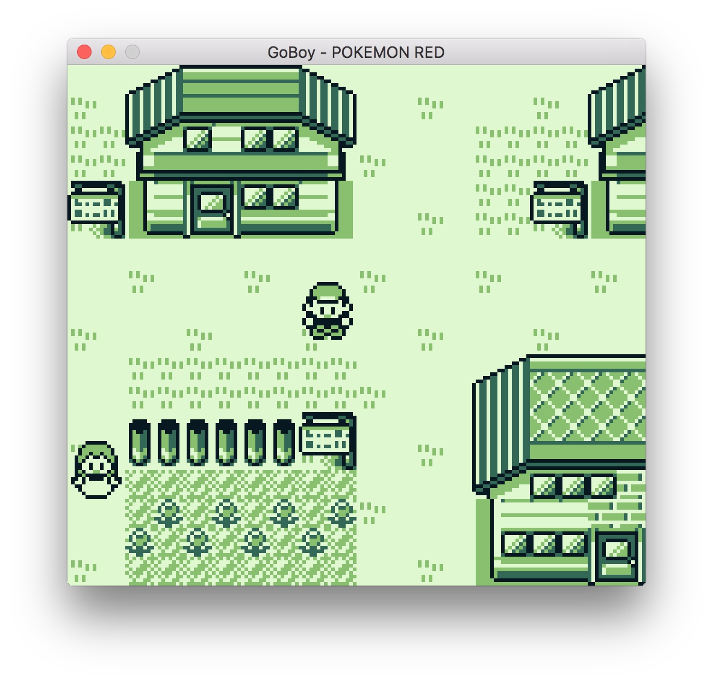
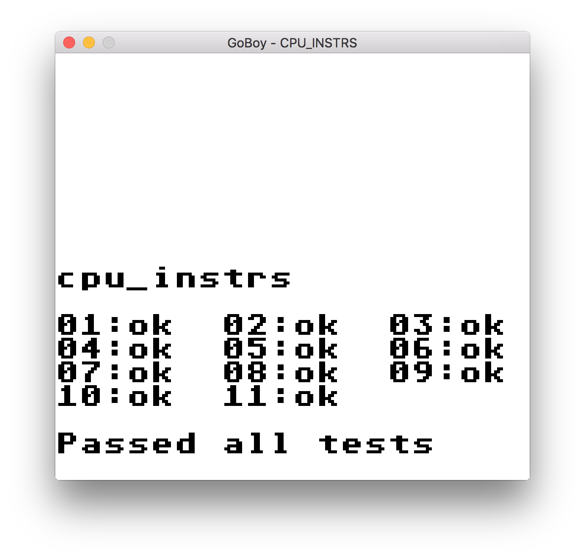

# GoBoy

[](https://travis-ci.org/Humpheh/goboy)
[](https://goreportcard.com/report/github.com/Humpheh/goboy)

GoBoy is a multi-platform Nintendo GameBoy emulator written in golang. 
This emulator was primarily built as a development exercise, and while still 
work in progress it should run the majority of GB games. There is also experimental
sound support implemented.



The program includes debugging functions which make it useful for understanding how the emulator is working or for building one yourself, such as a method for printing out opcodes and register values to the console at each step. Turning these on will slow down the emulation massively.

## Installation
```sh
go get github.com/Humpheh/goboy
```

The program has been tested on MacOS and Windows 10, and is likely to work on Linux. Building on Windows 10
requires MinGW (I recommend [msys2](http://www.msys2.org/)).

GoBoy uses pixel for control binding and graphics rendering. This requires the installation of OpenGL. Instructions on installing them can be found on the [pixels readme](https://github.com/faiface/pixel#requirements).

## Usage 
```sh
goboy -sound -rom zelda.gb
```
Controls: <kbd>&larr;</kbd> <kbd>&uarr;</kbd> <kbd>&darr;</kbd> <kbd>&rarr;</kbd> <kbd>Z</kbd> <kbd>X</kbd> <kbd>Enter</kbd> <kbd>Backspace</kbd>

The colour palette can be cycled with <kbd>=</kbd>


Other options:
```sh
  -cpuprofile string
        write cpu profile to file
  -disableVsync
        set to disable vsync
  -rom string
        location of rom file
  -sound
        set to enable sound emulation (experimental)
```

### Debugging
There are a few keyboard shortcuts useful for debugging: 

<kbd>Q</kbd> - force toggle background<br/>
<kbd>W</kbd> - force toggle sprites<br/>
<kbd>E</kbd> - toggle opcode printing to console (will slow down execution)<br/>
<kbd>7,8,9,0</kbd> - toggle sound channels 1 through 4.

### Saving 
If the loaded rom supports a battery a `<rom-name>.sav` (e.g. `zelda.gb.sav`) file will be created next to the loaded rom containing a dump of the RAM from the cartridge. A loop in the program will update this save file every second while the game is running.

## Testing
GoBoy currently passes all of the tests in Blargg's cpu_instrs test rom.



This rom is included in the source code along with a test to check the output is as expected (`instructions_test.go`).

## Contributing

Feel free to open pull requests to this project or play around if you're interested!

## Known Bugs 
- [ ] Sprite Z-drawing
- [x] Top half of sprite disappearing off top of screen
- [ ] Small sprites row glitch

## TODO List
- [x] MBC3 banking support
- [ ] MBC3 clock support
- [ ] Complete Sound emulation
- [ ] Speed up CPU (investigate switch vs map)
- [ ] Resizable window
- [ ] MBC4-7 support
- [ ] More colour palettes
- [ ] STOP opcode behaviour
- [ ] [Blargg's test ROMs](http://gbdev.gg8.se/wiki/articles/Test_ROMs) 
- [ ] GameBoy Color support

## Resources
A large variety of resources were used to understand and test the GameBoy hardware. Some of these include:
* <http://www.codeslinger.co.uk/pages/projects/gameboy/files/GB.pdf>
* <https://github.com/retrio/gb-test-roms>
* <http://www.codeslinger.co.uk/pages/projects/gameboy/beginning.html>
* <http://bgb.bircd.org/> - invaluable for debugging
* <https://github.com/AntonioND/giibiiadvance/tree/master/docs>
* <https://github.com/trekawek/coffee-gb>
