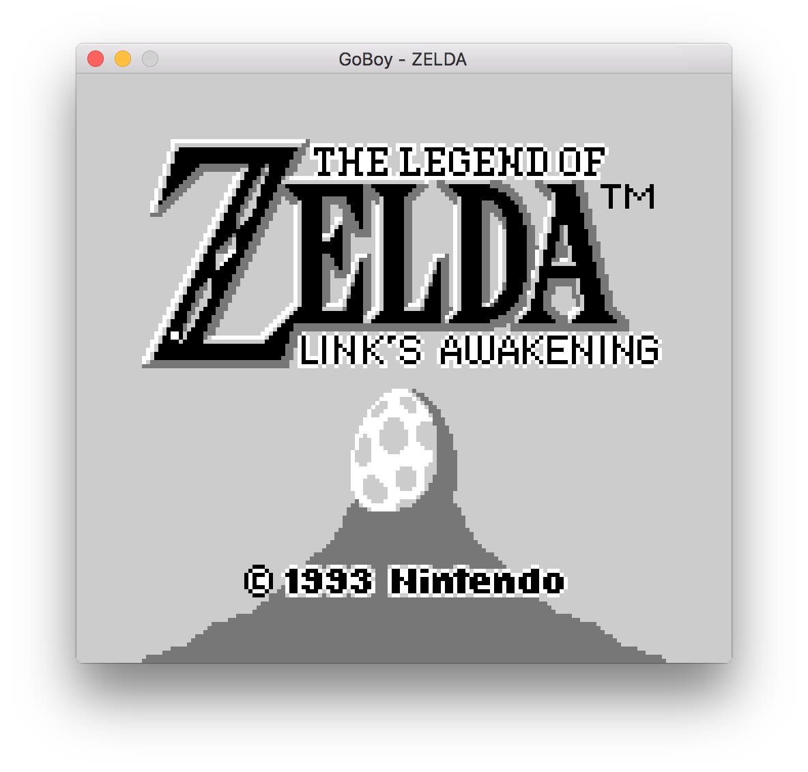

# GoBoy
GoBoy is a Nintendo GameBoy emulator written in golang. While it is work in progress it currently runs GB games that use MBC1/2 memory banking cartridges. This emulator was primarily built as a development exercise.



The program includes debugging functions which make it useful for understanding how the emulator is working or for building one yourself, such as a method for printing out opcodes and register values to the console at each step. Turning these on will slow down the emulation massively.

## Installation
```sh
go get github.com/Humpheh/goboy
```

GoBoy currently uses pixel for control binding and graphics rendering. This requires the installation of OpenGL. Instructions on installing them can be found on the [pixels readme](https://github.com/faiface/pixel#requirements).

## Usage 
```sh
goboy -rom zelda.gb
```
Controls: <kbd>&larr;</kbd> <kbd>&uarr;</kbd> <kbd>&darr;</kbd> <kbd>&rarr;</kbd> <kbd>Z</kbd> <kbd>X</kbd> <kbd>Enter</kbd> <kbd>Backspace</kbd>

The colour palette can be cycled with <kbd>=</kbd>

## Testing
GoBoy currently passes all of the tests in Blargg's cpu_instrs test rom.


This rom is included in the source code along with a test to check the output is as expected (`instructions_test.go`).

## Contributing

Feel free to open pull requests to this project or play around if you're interested!

## TODO List
- [ ] MBC3-7 support
- [ ] STOP opcode behaviour
- [ ] Sound
- [ ] [Blargg's test ROMs](http://gbdev.gg8.se/wiki/articles/Test_ROMs) 
- [ ] GameBoy Color support

## Resources
A large variety of resources were used to understand and test the GameBoy hardware. Some of these include:
* http://www.codeslinger.co.uk/pages/projects/gameboy/files/GB.pdf
* https://github.com/retrio/gb-test-roms
* http://www.codeslinger.co.uk/pages/projects/gameboy/beginning.html
* http://bgb.bircd.org/pandocs.txt
